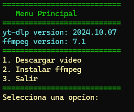

# Video Downloader con yt-dlp y PowerShell

**Última Actualización:** 04 de marzo de 2025

## Descripción

Este es un script de PowerShell que facilita la instalación de `ffmpeg`, la gestión de descargas de videos con `yt-dlp`, y permite seleccionar formatos, subtítulos y cookies.

## 📌 Características  
- Descarga e instalación automática de `ffmpeg`.  
- Soporte para `yt-dlp` con selección de formatos.  
- Posibilidad de agregar cookies para descargas autenticadas.  
- Interfaz interactiva con menú en consola. 

## 🚀 Requisitos

- Windows con PowerShell instalado.
- [yt-dlp](https://pypi.org/project/yt-dlp/) instalado con python.
- [7-Zip](https://www.7-zip.org/) para descomprimir `ffmpeg`.

## 📖 Uso

1. Al ejecutar el script, se mostrará un menú interactivo.
   (Si no se ejecuta "yt-dlp GUI.ps1" ejecuta "yt-dlp GUI.bat")
3. Ingresa la URL del video a través de una ventana emergente.
4. Selecciona el formato y subtítulos según disponibilidad.
5. Descarga y disfruta del contenido.

## 📝 Licencia

- Este proyecto está bajo la licencia MIT.

